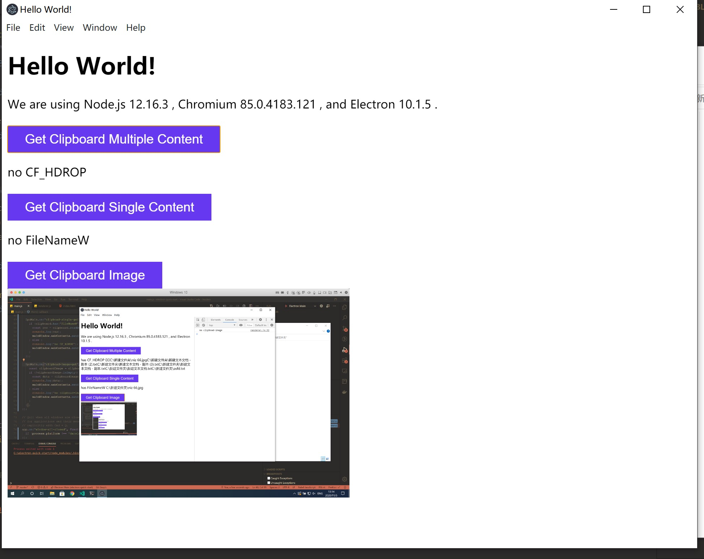

# electron-clipboard-demo

A demo to read clipboard file path in macOS or Windows



## To Use

```bash
# Clone this repository
git clone https://github.com/njzydark/electron-clipboard-demo
# Go into the repository
cd electron-clipboard-demo
# Install dependencies
npm install
# Run the app
npm start
```

## How it work

In this issue [https://github.com/electron/electron/issues/9035](https://github.com/electron/electron/issues/9035), the main solutions have been included, some use the c module, and some use the `read` Api. Here I summarize the use of read Api to read the file path in the pasteboard and support multiple files

### macOS

single file path

```js
clipboard.read('public.file-url')
```

multiple file path

```js
clipboard.read('NSFilenamesPboardType')
```

### Windows

single file path

```js
clipboard.readBuffer('FileNameW').toString('ucs2')
```

multiple file path

```js
clipboard.readBuffer('CF_HDROP').toString('ucs2')
```

## Clipboard image

Whether it is macOS or Windows, you can use the following methods to read the pictures in the clipboard

```js
clipboard.readImage('clipboard').toPNG()
```
